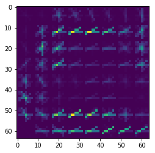
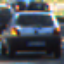
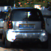

## ReadMe 

---
**Vehicle Detection Project**

The goals / steps of this project are the following:

* Perform a Histogram of Oriented Gradients (HOG) feature extraction on a labeled training set of images and train a classifier Linear SVM classifier
* Optionally, you can also apply a color transform and append binned color features, as well as histograms of color, to your HOG feature vector. 
* Note: for those first two steps don't forget to normalize your features and randomize a selection for training and testing.
* Implement a sliding-window technique and use your trained classifier to search for vehicles in images.
* Run your pipeline on a video stream (start with the test_video.mp4 and later implement on full project_video.mp4) and create a heat map of recurring detections frame by frame to reject outliers and follow detected vehicles.
* Estimate a bounding box for vehicles detected.

### [Rubric Points](https://review.udacity.com/#!/rubrics/513/view)

#### Feature Extraction

Our pipeline used an SVM in order to identify cars in an image. This was done by using a combination of spatial feature mapping, color histograms, and HoG (Histogram of Gradients) methods. Spatial mapping resizes our image and creates a 1 dimensional vector of each color space, allowing pattern recognition of the order that our colors tend to change in space. Color histogram binning allows pattern recognition based on the frequency of intensity of colors. Our HoG method effectively measures the direction of gradients (from dark to light) over a selected box area, and allows the comparison of high level relative shapes found in an image.

Meta parameters were chosen through expermentation, with favor given to values that were along the Binary Logarithm curve for simplicity as a divisor. The YCrCb color space was chosen after experimenting with other spaces. HSV was a close competitor, however YCrCb consistently performed well when fed into our SVM for classification. The other parameters of orientation = 9, cells_per_block = 2, pxiels_per_cell = 8, channels = 'ALL', were also chosen based on expiermentation, and proved to yield the best consistent results throughout testing.

The HoG extraction process for our SVM can be viewed in block 3 on lines 18-33. Here is an example of a training image used, and the HoG extraction of it's 3 color channels.

#### Classifier Training

After extracting spatial bin, color histogram, and HoG features for each dataset image (Block 4), the features were  normalized with SKLearn StandardScaler (Block 5), Split using sklearn train_test_split (Block 6), and fit to a Linear SVM to create a vehicle detector (Block 7).

Orringinally, the SVM had a 99.9% testing accuracy, however was giving many false-positives and flase negatives when used in pipeine. This was caused by time series images in our training and testing dataset. As the time series images were almost identical, it was apparent that training and testing on these images would yield and inflated accuracy. In order to increase the accuracy of the SVM under operational conditions, the training data was adjusted to ensure that time series images from the GTI dataset were added to our training data after a train_test_split was performed on our diverse KITTI datasets. This knocked Testing accuracy down by .9%, however greatly increased pipeline performance.

The first 3 images below are part of a time series from the [GTI dataset](http://www.gti.ssr.upm.es/data/Vehicle_database.html), while the following 3 are from the [KITTI dataset](http://www.cvlibs.net/datasets/kitti/). Notice how the last 3 are vastly different, even though they are sequential in the dataset.

#### Pipeline

In order to scan our image for vehicles, a sliding window technique was implemented by moving nxsteps and nysteps incrementaly accross the bottom half our image (Block 9, starting on line 46). The values for the scale, size of window, and overlap were again chosen based on experimentation, with preference given to Binary Logarithmic scale numbers. The window size to be 64 in order to mirror our training set, with a scale of 1.5 to allow a larger area to be searched with each window. The overlap of each image was chosen to be 2 cells (or 16 pixels, 1/4th of our window) in order to provide sufficient accuracy for our detection algorithm, however, not so accurate as to over tax our computing resources.

Seen below is the result of performing the sliding window on an image

In order to filter out false possitives and diminish the effects of periodic false negatives, a series of heatmap functions were performed on input images (Block 11). Heat was added and subtracted for each bounding box detected in our image  and compared to a minimum threshold. Pixels that met the threshold were fed into scipy labels in order to determine how many unique vehicles were in the image, while pixels that did not meet the threshold were discarded as false possitives. Heatmaps were tracked between frames using a class vehicle_tracker (Block 12), which decreased false negatives. This was accomplished by allowing a heat bank of up to 10 degrees, and cooling every pixel by 2 degrees when there are no boxes present (5 frames maximum cooldown time).

#### Result

The final results of the pipeline can be viewed in the following video (click on [this link](./Vehicle_detection.mp4) and download if the video is not loading)

#### Reflections

* The SVM is very sucesptible to it's data set. Originally poor results were generated when tweaking meta-variables. Following this the dataset was broken from; car, non-car,  into; car, non-car, car-time-series. the car-time-series was then added to the training data after performing train_test_split. This decreased testing accuracy by ~.9%, however it greatly increased performance.

* Derived from the above paragraph, a larger dataset would likley greatly benefit our detection ability. Addtionally the inclusion of hard-negatives from our project video would allow an improved performance, specifically where the shading changes rapidly in the image.

* A neural net would likely offer an excellent alternative to our SVM, however time constraints on training and testing were not conducive of that path for the moment.
